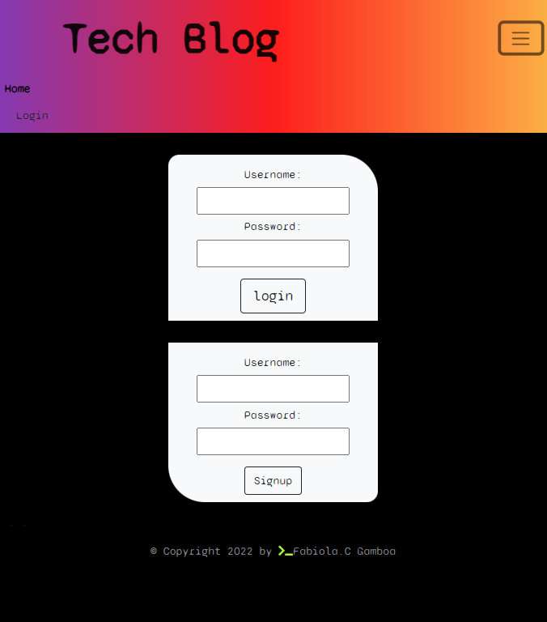

# MVC-Tech-Blog

# Table of Contents

---

[Description](#Description)

[Installations](#Installations)

[Usage](#Usage)

[Credits](#Credits)

[License](#License)

[Test](#Test)

[Questions](#Questions)

# Description

GIVEN a CMS-style blog site WHEN I visit the site for the fist time THEN I am presented with the homepage, which includes existing blog posts if any have been posted; navigation links for the homepage and the dashboard; and option to log in WHEN I click on the home option THEN I am taken to the homepage WHEN I click on any other links in the navigation THEN I am prompted to either sign up or sign in WHEN I choose to sign up THEN I am prompted to create a username THEN if I logged in I am able to create a post about any news about technology or information I want to share.

# Installation

    express-sessions express-handlebars MySQL Sequelize dotenv connect-session-sequelize

# Usage

    use "npm run seed" the "nodemon" or "node server.js" also find the app link here to see the app

# Credits

none

# License

# Test

     nodemon

# Questions

---

## If you have any further questions about this project, you can always contact me here:(Click Enter)

## Name

Fabiola C. Gamboa

## [Heroku](https://afternoon-crag-71461.herokuapp.com/)

## [Github](https://github.com/Fabscg)

## [Email](fabiscg79@gmail.com)

## 
